# Nova Studio

<div align="center">

**English** · [简体中文](README.zh-CN.md)

**Self-hosted AI video/image generation workbench · bring your own models · multi-mode · PWA · live task updates**

[](https://github.com)
[](LICENSE)
[](https://nodejs.org)
[](https://nextjs.org)
[](https://react.dev)

</div>

---

## 📖 Overview

Nova Studio is an AI video/image generation workbench for individuals and small teams. The frontend is a Next.js 16 + React 19 static export (PWA); the backend is a small Node.js service (`server.js` + SQLite + WebSocket) that schedules tasks and proxies generation APIs.

**What the open-source edition gives you:**

- Image models and text models are configured separately, each with its own API key and base URL
- You define the model list and endpoints yourself; the backend routes by protocol and passes your parameters through
- All client configuration lives in the browser's localStorage
- Text models support Google (`generateContent`) and OpenAI (Responses protocol)
- **Video generation is fully plugin-based**: the host ships no upstream video protocol at all — capability comes from plugin packs

> Current version: **v3.3.0**

## 📚 Documentation

Everything lives under [`docs/`](docs/). The plugin protocol docs are written in Chinese.

| I want to… | Go here |
| --- | --- |
| **Write a video plugin** | **[docs/plugins/](docs/plugins/)** ← start here |
| Install a ready-made plugin | [nova-studio-plugins](https://github.com/tianjiangqiji/nova-studio-plugins) (official collection + template) |
| Get a working plugin in 10 minutes | [docs/plugins/quickstart.md](docs/plugins/quickstart.md) |
| Have an AI write the plugin for me | [docs/plugins/LLM.md](docs/plugins/LLM.md) (paste the whole file into your AI) |
| Look up a protocol field | [manifest](docs/plugins/manifest.md) · [ui.schema](docs/plugins/ui-schema.md) · [provider](docs/plugins/provider.md) |
| Debug a plugin that won't load / a failing task | [docs/plugins/errors.md](docs/plugins/errors.md) |
| Copy a known-good pattern | [docs/plugins/cookbook.md](docs/plugins/cookbook.md) |
| Understand the task lifecycle | [docs/plugins/lifecycle.md](docs/plugins/lifecycle.md) |

## 💎 Sponsors

Your sponsorship is welcome.

---

## 🖼️ UI Preview

### Image workbench

| Wide | Narrow | Mobile |
|:---:|:---:|:---:|
| 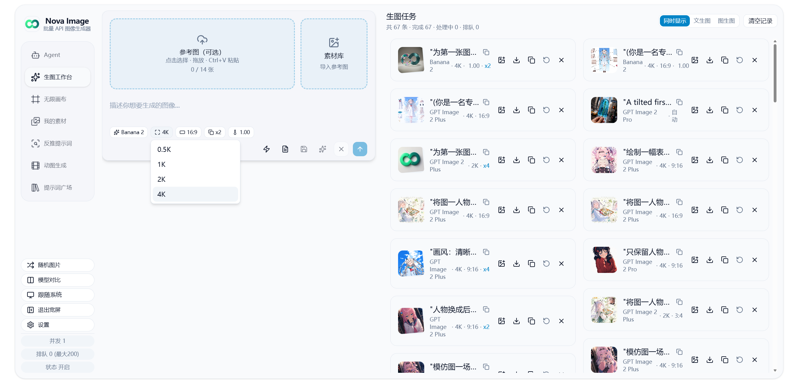 | 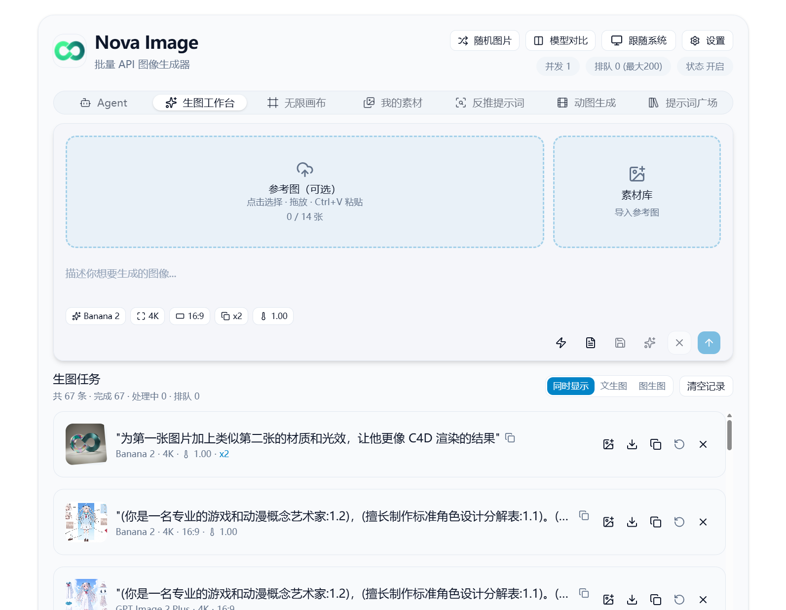 | 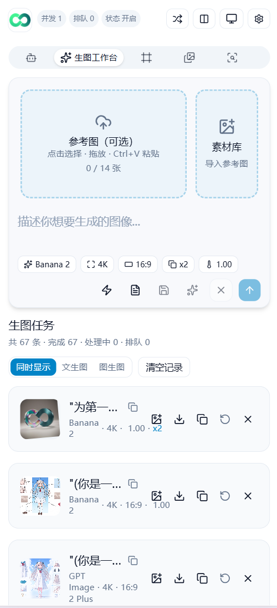 |

### Video workbench (plugin-driven)

The whole left-hand form is rendered from the plugin's `ui.schema.json` — tiers, resolutions, durations and media slots are all declared by the plugin; the host knows nothing about any specific upstream. Credentials are filled in per plugin under Settings → Plugins.

| Workbench | Settings → Plugins |
|:---:|:---:|
| 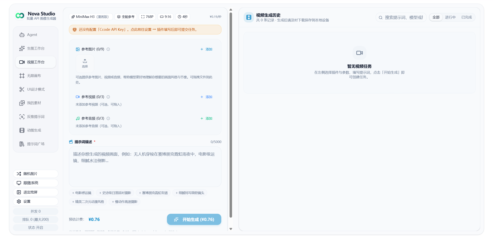 | 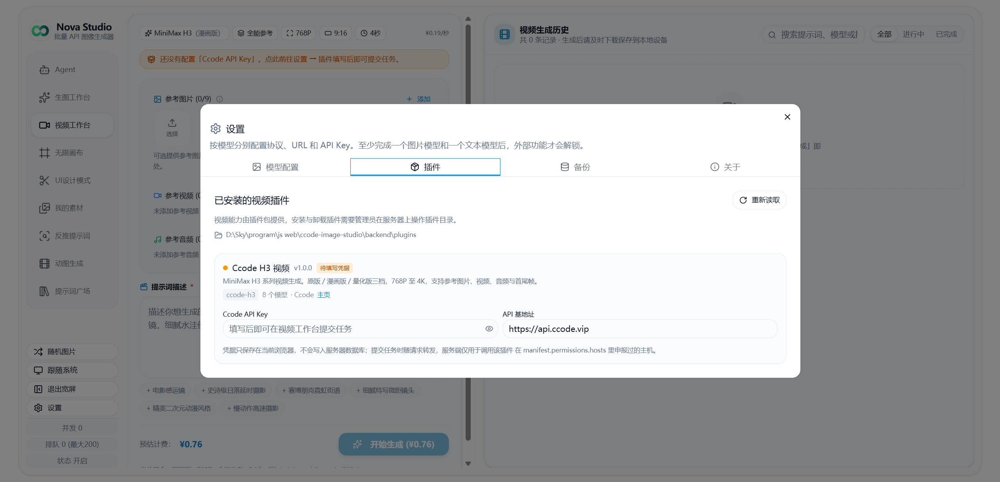 |

### UI design mode (image slicing + web reproduction)

Starting from one UI mockup: AI auto-slices it → you adjust in the slice editor → a multi-turn agent reproduces the page → export the full design package.

| ① Source mockup | ② Import and slice | ③ Auto-slice + manual fixes | ④ Start web reproduction |
|:---:|:---:|:---:|:---:|
| 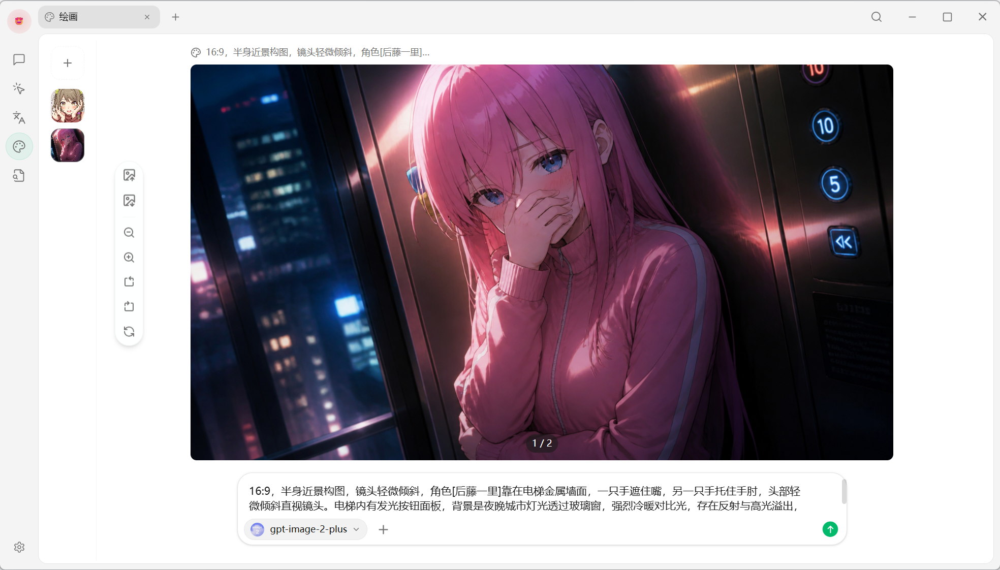 |  | 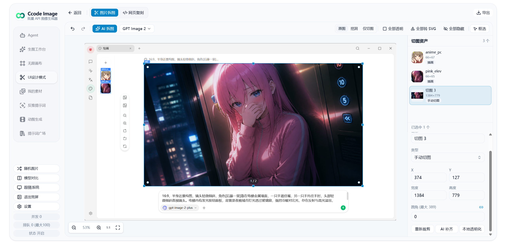 |  |

| ⑤ Agent edits the copy | ⑥ Multi-turn refinement | ⑦ Export as ZIP | ⑧ Final result |
|:---:|:---:|:---:|:---:|
| 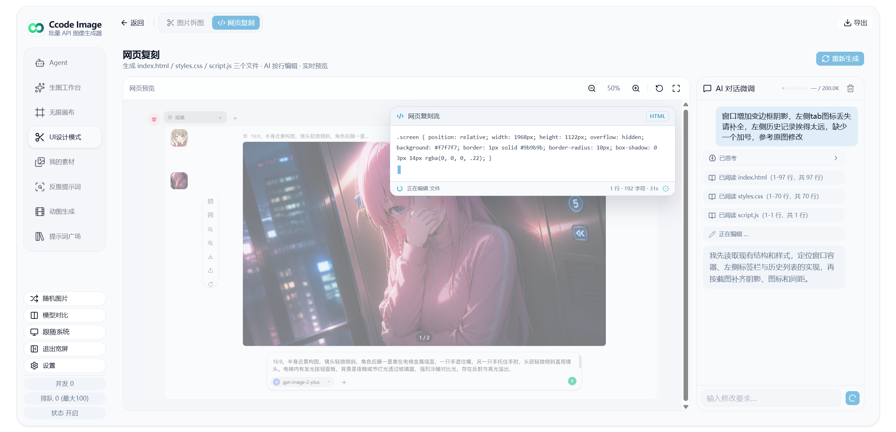 |  |  | 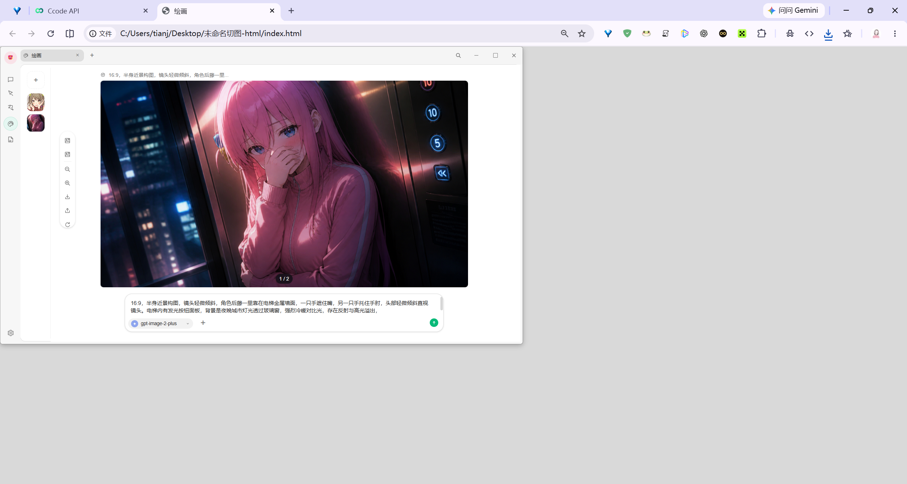 |

### Agent mode

| Ask | Generate |
|:---:|:---:|
| 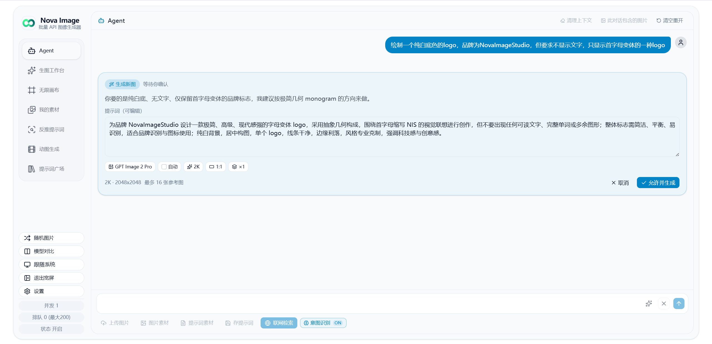 | 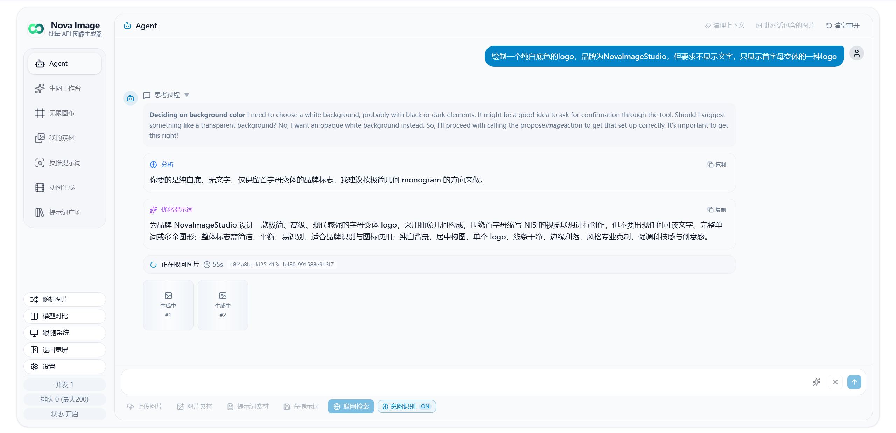 |

### GIF generation

| Generate | Fine-tune |
|:---:|:---:|
| 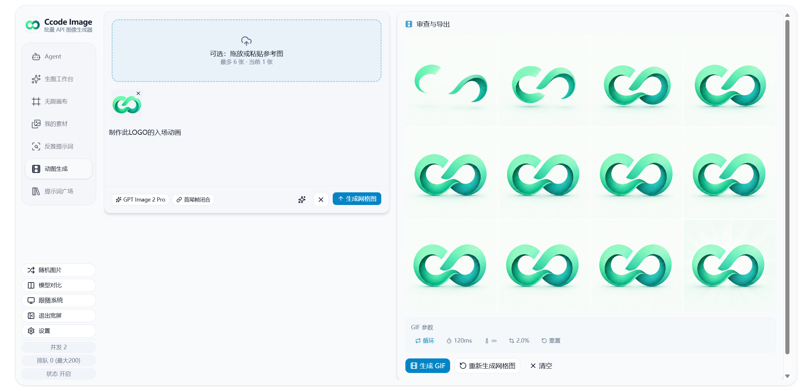 | 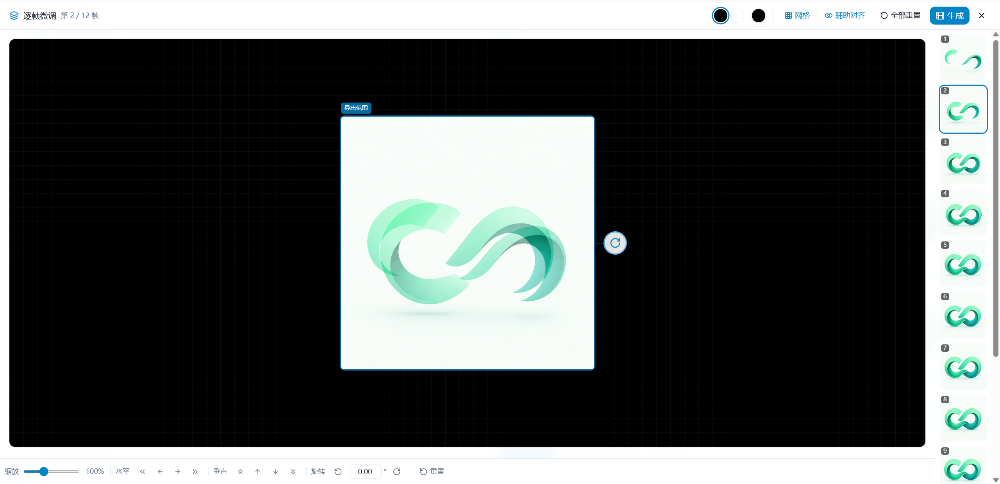 |

### Infinite canvas

| Preview | Edit |
|:---:|:---:|
| 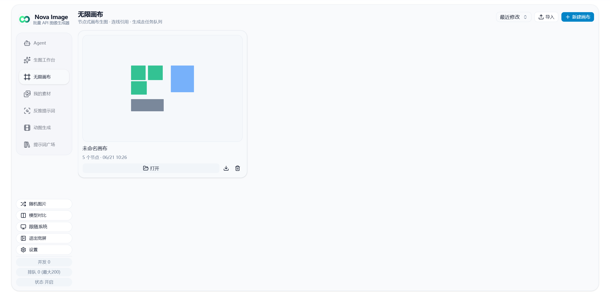 | 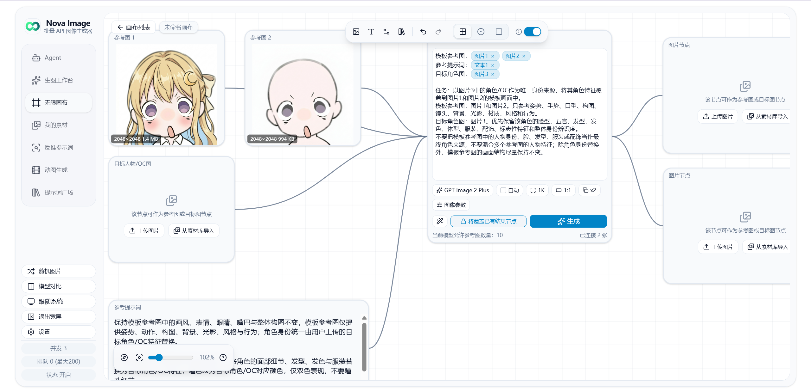 |

### Other features

| Reverse prompt | Prompt gallery | My assets | Settings |
|:---:|:---:|:---:|:---:|
| 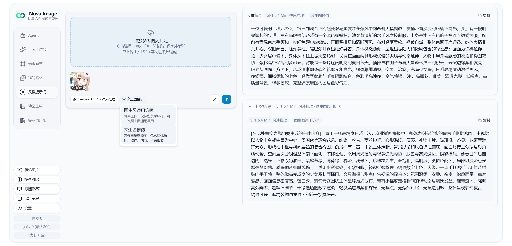 | 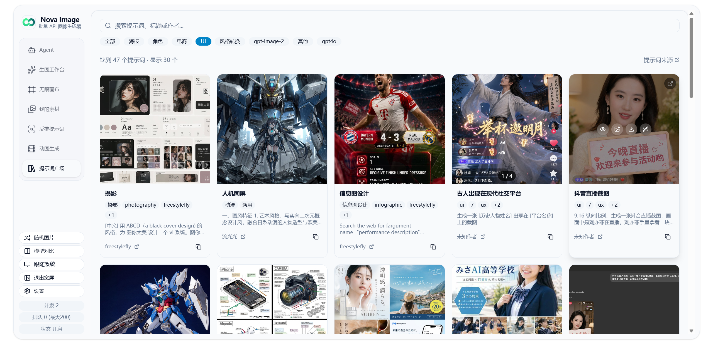 | 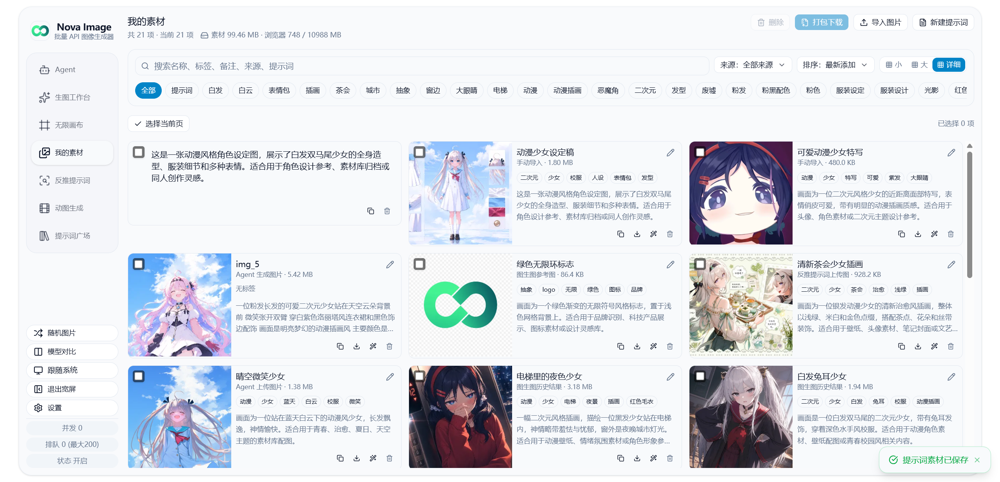 | 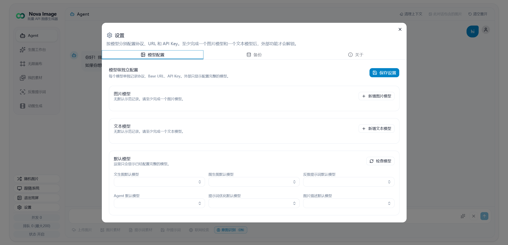 |

---

## ✨ Features

### Seven working modes

| Mode | Entry point | Summary |
| --- | --- | --- |
| 🎨 Text to image | `TextToImageForm` | Generate from a text prompt, multiple images in parallel |
| 🖼️ Image to image | `ImageToImageForm` | Upload references to edit / convert / restyle |
| 🤖 Agent | `AgentChatWorkspace` | Conversational generation: chat → plan → images, with vision descriptions, web search, reasoning, and local browser CDP (open/read pages; Taobao product pages can extract title/SKU/main images) |
| ✂️ UI design mode | `SliceWorkspace` | UI mockup → slice assets → web reproduction (wide screens only, see below) |
| 🔍 Reverse prompt | `ReversePromptForm` | Upload an image and stream back a prompt (any configured text model) |
| 🎬 GIF generation | `GifGenerationWorkspace` | Multi-frame generation + grid assembly, GIF encoded in-browser (`gifenc`) |
| 🎥 Video workbench | `PluginWorkbench` | Powered by **video plugins**; the host ships no upstream protocol (see below) |

### Video workbench (plugin-based)

Video generation contains no upstream-specific protocol. The host provides the tab, task queue, history, media upload and form rendering; "who to call, what to send, how to poll, where the result is, what the form looks like" all live in the plugin pack.

- **Installation**: an admin drops the plugin directory into `backend/plugins/`, then restarts the backend (or clicks "Reload" in Settings)
- **Plugins are pure JSON**: three files (`manifest.json` / `ui.schema.json` / `provider.json`), no executable code
- **Egress must be declared**: any host outside `permissions.hosts`, plus every private/loopback address, is refused
- **Credentials belong to the user**: apiKey / baseUrl are entered under Settings → Plugins, stored in the browser, never in the database
- **The settings page is read-only**: it lists what is installed and why a pack failed to load; installing and removing plugins requires server access
- **Reference implementation**: `backend/plugins/ccode-h3/` (MiniMax H3 — 8 models, first/last frame, reference image/video/audio, upscaled tiers)
- **Result URLs pass through untouched**: no domain rewriting, the video link is exactly what the upstream returned

📦 **Official plugin collection: [nova-studio-plugins](https://github.com/tianjiangqiji/nova-studio-plugins)**
— includes a minimal plugin template and can be cloned straight into `backend/plugins/`:

```bash
cd backend/plugins && git clone https://github.com/tianjiangqiji/nova-studio-plugins.git .
```

👉 **Writing your own plugin (or having an AI write it): [docs/plugins/](docs/plugins/)**
(paste [docs/plugins/LLM.md](docs/plugins/LLM.md) into your AI verbatim)

### UI design mode (image slicing + web reproduction)

Break a flat UI mockup into reusable slice assets, then reproduce it as a previewable web page. **Wide-screen only** — narrow screens show a hint to switch.

- **AI slicing**: a vision model proposes slices and background candidates; you tick them off in a confirmation dialog before anything is stored. A JSON parse failure triggers one automatic image-free repair retry
- **Slice editor**: zoom/pan, drag-to-create, rubber-band multi-select, 8-way resize, per-corner radius, snapping, context menu, full undo/redo (50 steps) and keyboard shortcuts
- **Three view modes**: original (source + outlines) / knockout (post-cutout result, generated locally at no cost) / slices only (checkerboard)
- **Four asset operations**: algorithmic transparency, AI transparency, algorithmic SVG vectorization (`imagetracerjs`), AI SVG redraw. All four are independently revertible and never overwrite each other; algorithmic ones support batches, AI ones fire one at a time (so a single click can't rack up charges)
- **Background fill**: adjust the blue box (background extent) and red box (removal region) in the confirmation dialog, then call masked image editing to fill in what the foreground covered; produces both a "local composite" and an "AI original" for you to choose from
- **Web reproduction**: a multi-turn AI agent producing exactly three files (`index.html` / `styles.css` / `script.js`) plus a read-only `assets/`. The agent edits by line via `read_file` / `edit_file`, previews live in an iframe, and context usage is taken from the API's reported `input_tokens` (warn at 140K, refuse at 175K)
- **Export**: slice package ZIP (PNG + optional SVG + manifest) or a full design package (source image, workspace metadata and the `web/` files), and workspaces can be restored from an export
- **Storage**: workspaces and images live in IndexedDB (`nova-slice-db`) and are covered by one-click backup/restore

> ⚠️ "AI fill" (brush-mask inpainting) is not in this release. Its request pipeline is shared with background fill and works, but a render-ordering defect in the editor component needs fixing first.

> Image-editing features (AI transparency, background fill) need an **OpenAI-protocol** image model: they rely on `/v1/images/edits` with a `mask`, which the Gemini and Grok protocols have no equivalent for, so those models don't appear in the slice page's model picker.

### Prompt gallery

`PROMPT_GALLERY_MODE` has three settings:

- `1` always on: the tab is always visible
- `2` private: password required (from the backend env var `PROMPT_GALLERY_PASSWORD`)
- `3` off: hidden entirely

Content is maintained in `backend/prompts.json`, with profanity filtering via `backend/blacklist.json`.

### Model system

Nova Studio is built around **user-defined models**:

- **Per-model configuration**: every image and text model stores its own protocol, display name, model ID, API key and base URL
- **Image models**: add, edit and delete freely; set protocol, display name, model ID, max reference images and max resolution
- **Image 2 extra parameters**: shown for OpenAI image models only — transparent background, quality and style controls are on by default and can be turned off
- **Text models**: freely extensible, compatible with Gemini and OpenAI Responses
- **Default models**: set a separate default for text-to-image, image-to-image, reverse prompt, Agent, AI slicing, web reproduction and slice image editing
- **Four text protocols**: OpenAI Responses / OpenAI Chat Completions / Anthropic Messages / Google Gemini, all with multi-turn tool calling (the web-reproduction agent depends on it), all forwarded through `/api/nova/proxy/text`

### Task system

- Submissions are queued and processed concurrently server-side (default cap 50, tune with `NOVA_TASK_CONCURRENCY`)
- The browser receives task/queue updates over **WebSocket**, reconnects automatically, and falls back to **HTTP polling** (30s interval) after 5 failures
- Results are written to disk (default `backend/data/nova-images/`, configurable via `NOVA_IMAGE_DIR`) and served directly at `/api/nova/images/:taskId/:index`
- Tasks have a 12-hour TTL (`NOVA_TASK_TTL_HOURS`), cleaned up automatically every 5 minutes
- On restart, leftover "processing" tasks are marked failed and their artifacts deleted, so no ghost tasks linger

### Experience & engineering

- PWA (`next-pwa`), installable to the desktop
- Adaptive UI across desktop, tablet and mobile
- Dark / light theme toggle
- Wide / narrow adaptive layout (vertical tabs on the left, content on the right)
- Persistent task history (IndexedDB / localStorage)
- One-click backup / restore (`JSZip` over localStorage + IndexedDB; incompatible legacy config is skipped and the rest still restores)
- Lazy-loaded history images (`@tanstack/react-virtual`)
- Random wallpapers, toasts, confirmation dialogs

---

## 📁 Project layout

```text
nova-image-studio/
├── frontend/                 # Next.js frontend (React 19 + TS)
│   ├── src/
│   │   ├── app/              # root layout.tsx / page.tsx
│   │   ├── components/       # feature components + shadcn/ui primitives
│   │   │   ├── workspace/    # main shell, tabs, header, results pane
│   │   │   ├── agent/        # Agent mode
│   │   │   ├── plugin/       # video plugin host: schema form, media slots, history, progress
│   │   │   ├── settings/     # settings sections (plugin list and credentials)
│   │   │   ├── slice/        # UI design mode: slice editor, asset panel, web reproduction
│   │   │   └── ui/           # shadcn-style primitives
│   │   ├── hooks/            # useQueueStatus / useAgentChat / useGifWorkflow / ...
│   │   ├── lib/              # client utils, API clients, WebSocket, backup
│   │   │   ├── plugin-*.ts   # plugin schema solver, task client, history, upload
│   │   │   ├── slice-*.ts    # slice geometry/crop/vectorize/export/AI clients
│   │   │   └── web-agent/    # web reproduction agent: virtual FS, tools, main loop
│   │   └── test/             # vitest config and cases
│   ├── public/               # PWA icons, static assets
│   ├── next.config.ts        # static export + next-pwa config
│   ├── package.json
│   └── vitest.config.ts
├── backend/
│   ├── server.js             # Node service (HTTP + WS + SQLite + task queue)
│   ├── cdp.js                # browser CDP tools (connect to local Chrome debug port)
│   ├── taobao-extract.js     # Taobao/Tmall product-page extractor
│   ├── plugin-runtime/       # video plugin runtime: registry, validation, templates, executor, media, verify CLI
│   ├── plugins/              # installed video plugins (placed by an admin)
│   │   └── ccode-h3/         # reference implementation: MiniMax H3
│   ├── prompts.json          # prompt gallery content
│   ├── blacklist.json        # blocked words
│   ├── .env.example
│   └── package.json
├── desktop/                  # Electron desktop shell (Windows / macOS)
├── docs/
│   ├── images/               # README screenshots
│   └── plugins/              # video plugin docs (including LLM.md for AI consumption)
├── scripts/
│   ├── pack.js               # packaging: build + collect into out.zip
│   └── generate-icons.js     # generate PWA icons
├── package.json              # npm workspaces root
├── LICENSE                   # AGPL-3.0
└── README.md
```

> Production builds land in `frontend/out/` and are served statically by `server.js`.

---

## 🖥️ Desktop (Windows / macOS)

The desktop build packs frontend, backend and the Electron shell into a single installer. No separate Node.js setup is required.

- **Install**: download the platform package from Releases (macOS `.dmg` / `.zip`, Windows `.exe`).

  > ⚠️ Packages are unsigned: on macOS first-open via Finder **right-click → Open**; on Windows choose **Run anyway** at SmartScreen.

- **Build from source**:

  ```bash
  npm install                 # root deps (electron / electron-builder)
  npm run install:all         # frontend + backend deps
  npm run electron:dist:win   # Windows installer
  npm run electron:dist:mac   # macOS package
  ```

  Artifacts land in `release/`.

- **Data**: SQLite and generated images live in the OS userData directory. Reinstalling the app does not wipe them.
- **Desktop-only**: one-click debug browser launch and browser CDP tools (see below).

---

## 🌐 Browser CDP

Chrome DevTools Protocol talks to a local debug port (default 9222; Agent can switch to 9224). With the Agent "browser" switch on, it can open/list tabs and read page text. For Taobao/Tmall product pages, `browser_read_taobao` extracts title, price, shop, SKU, main images and detail images.

CDP only binds `127.0.0.1` and only reads tabs you opened.

---

## 🚀 Deployment

<details>
<summary><strong>🐳 Docker Compose</strong></summary>

### Requirements

- Docker 20.10+
- Docker Compose v2

### Quick start

```bash
# 0. clone the repo
git clone https://github.com/tianjiangqiji/nova-image-studio.git
cd nova-image-studio

# 1. copy the Docker env template to the project root (mounted as /app/.env)
cp backend/.env.docker.example .env
# edit .env as needed (rate limits, gallery password, ...)

# 2. copy the config files to the root (compose mounts them into the container)
cp backend/blacklist.json blacklist.json
cp backend/prompts.json prompts.json
# if the repo has neither: touch blacklist.json prompts.json and fill them in

# 3. create the data and plugins directories
mkdir -p data
mkdir -p plugins
# copy the built-in plugin to the host (the mount shadows the in-image plugins dir;
# skip this and the built-in plugin disappears)
cp -r backend/plugins/ccode-h3 plugins/

# 4. start
docker compose up -d

# At runtime you need only:
# docker-compose.yml, .env, blacklist.json, prompts.json, data/, plugins/
```

Open <http://localhost:3000>.

### Environment variables

Injected by mounting the root `.env` at `/app/.env` (the code reads `process.cwd()/.env`), so the image never needs rebuilding.

After editing:

- Runtime config (rate limits, queue, gallery mode, …) takes effect within about a second
- `PORT` / `HOSTNAME` / `NODE_ENV` / data paths require a restart

```bash
docker compose restart
```

### Upgrading

```bash
docker compose down
docker compose pull
docker compose up -d --force-recreate
```

### Persistence

`docker-compose.yml` mounts:

| Host | Container | Purpose |
| --- | --- | --- |
| `./data` | `/app/backend/data` | database + images (including WAL/SHM) |
| `./.env` | `/app/.env` | environment variables |
| `./blacklist.json` | `/app/backend/blacklist.json` | blocked words |
| `./prompts.json` | `/app/backend/prompts.json` | prompt gallery |
| `./plugins` | `/app/backend/plugins` | video plugins (shadows the in-image dir; edit plugins without rebuilding the image) |

Plugins are loaded once at process startup; after adding/removing/editing plugins in the host `./plugins/`, restart the container, or hit `/api/nova/plugins?reload=1` to rescan without a restart.

What actually ends up in `./data` (determined by the `NOVA_*` paths):

- `nova-tasks.sqlite` (plus `-wal` / `-shm`) — task database
- `nova-images/` — generated images

</details>

<details>
<summary><strong>📦 Bare-metal deployment (production)</strong></summary>

### Requirements

- **Node.js** 20 or 22
- **npm** (workspaces support is built in)
- `better-sqlite3` is a native dependency — the production server **must** run `npm ci --omit=dev` locally; do not copy `node_modules` from your dev machine

### Steps

#### 1. On the build machine

```bash
npm ci
npm run build
```

This produces `frontend/out/`.

#### 2. Upload to the production server

```text
frontend/out/
backend/server.js
backend/package.json
backend/package-lock.json
backend/prompts.json
backend/blacklist.json
backend/.env          # adjusted for production (cwd=backend)
```

Recommended `backend/.env`:

```env
NODE_ENV=production
NOVA_TASK_DB=./data/nova-tasks.sqlite
NOVA_IMAGE_DIR=./data/nova-images
```

#### 3. On the production server

Run from the project root (`npm start` does `cd backend` for you):

```bash
cd backend && npm ci --omit=dev   # better-sqlite3 must be built locally
cd ..
npm start                         # equivalent to cd backend && node server.js
```

The service creates the database and image directories under `backend/data/` on first run.

#### 4. Process supervision

Use **PM2 / systemd / your platform's process manager**, making sure that:

- The working directory ends up at `backend/` (matching `npm start`), or configure `NOVA_TASK_DB` / `NOVA_IMAGE_DIR` with absolute paths
- The process can read and write `backend/data/` (or wherever you pointed it)
- Your reverse proxy (Nginx / Caddy / cloud gateway) forwards the domain to `http://127.0.0.1:3000`

#### 5. One-shot packaging

```bash
npm run go
```

Produces `out.zip` in the root; unzip it and follow steps 1–3 above.

</details>

<details>
<summary><strong>💻 Local development</strong></summary>

### Requirements

- **Node.js** 20 or 22
- **npm** (workspaces support is built in)

### Install and run

```bash
# 1. clone
git clone https://github.com/tianjiangqiji/nova-image-studio.git
cd nova-image-studio

# 2. install (root, frontend and backend together)
npm install

# 3. copy the backend env file (locally cwd=backend, so paths are ./data/...)
cp backend/.env.example backend/.env
# Windows: Copy-Item backend/.env.example backend/.env
# check that backend/.env has:
#   NOVA_TASK_DB=./data/nova-tasks.sqlite
#   NOVA_IMAGE_DIR=./data/nova-images

# 4. start dev mode (builds, then runs server.js in production mode)
npm run dev
```

Open <http://localhost:3000>. Local data lands in `backend/data/` (database + `nova-images/`).

> On first launch you need to configure at least one image model and one text model in Settings, and pick defaults. All client configuration is stored in the browser's localStorage and can be exported via the backup feature.

### Common scripts

```bash
npm run dev:frontend   # Next.js dev server only (HMR, no static export)
npm run dev:backend    # backend server.js only
npm run build          # build the frontend into frontend/out/
npm start              # run the backend directly
npm run lint           # frontend ESLint
npm test               # frontend Vitest (watch)
npm run test:run       # frontend Vitest (single run)
npm run go             # package: build + collect into out.zip
```

Backend-side checks:

```bash
cd backend
npm test                  # backend unit tests (includes plugin runtime)
npm run plugins:verify    # validate installed plugins + run their fixtures
```

</details>

<details>
<summary><strong>🔨 Building the Docker image</strong></summary>

```bash
docker build -t nova-image-studio:latest .

docker tag nova-image-studio:latest tianjiangqiji/nova-image-studio:latest
docker push tianjiangqiji/nova-image-studio:latest
```

</details>

---

## ⚙️ Environment variables

| Scenario | Template | Copy to | Data paths (already set in the template) |
| --- | --- | --- | --- |
| Local dev / bare-metal production | `backend/.env.example` | `backend/.env` | `./data/nova-tasks.sqlite`, `./data/nova-images` |
| Docker Compose | `backend/.env.docker.example` | root `.env` | `backend/data/nova-tasks.sqlite`, `backend/data/nova-images` |

| Variable | Required | Default | Description |
| --- | --- | --- | --- |
| `PORT` | no | `3000` | Listen port |
| `HOSTNAME` | no | `0.0.0.0` | Bind address; `localhost`/`127.0.0.1` means local-only |
| `NODE_ENV` | **yes** | `production` | **Must be `production`**, otherwise Next dev mode kicks in |
| `NOVA_TASK_DB` | no | `./nova-tasks.sqlite` | SQLite path (relative to `process.cwd()`); prefer `./data/...`, or `backend/data/...` under Docker |
| `NOVA_IMAGE_DIR` | no | `./nova-images` (relative to `__dirname`, i.e. `backend/`) | Where task artifacts are written; prefer `./data/nova-images`, or `backend/data/nova-images` under Docker |
| `NOVA_TASK_CONCURRENCY` | no | `50` | Max concurrent tasks (hard ceiling 50) |
| `NOVA_TASK_TTL_HOURS` | no | `12` | Task lifetime in hours; tasks and images are deleted after this |
| `NOVA_MAX_QUEUE_SIZE` | no | `200` | Global cap on pending tasks |
| `NOVA_RATE_LIMIT_WINDOW_MS` | no | `60000` | Rate-limit window for task creation, in ms |
| `NOVA_RATE_LIMIT_MAX_REQUESTS_PER_IP` | no | `20` | Max tasks one IP may create per window |
| `NOVA_RATE_LIMIT_MAX_REQUESTS_PER_API_KEY` | no | `20` | Max tasks one API key may create per window |
| `NOVA_MAX_PENDING_TASKS_PER_IP` | no | `20` | Max simultaneous pending tasks per IP |
| `NOVA_MAX_PENDING_TASKS_PER_API_KEY` | no | `10` | Max simultaneous pending tasks per API key |
| `NOVA_RATE_LIMIT_RETRY_AFTER_SECONDS` | no | `30` | `Retry-After` seconds when the queue is full or rate-limited |
| `PROMPT_GALLERY_MODE` | no | `2` | `1` always on / `2` private password (tap the title 7×) / `3` off |
| `PROMPT_GALLERY_PASSWORD` | no | empty | Password for private mode; empty means private mode opens directly |
| `NOVA_PLUGINS_DIR` | no | `backend/plugins` | Video plugin directory (where an admin drops plugins) |
| `NOVA_PLUGIN_MEDIA_DIR` | no | `backend/data/plugin-media` | Where uploaded reference media is stored |
| `NOVA_PLUGIN_MEDIA_TTL_MS` | no | `86400000` | How long orphaned media (not bound to a task) is kept, in ms |
| `NOVA_MEDIA_MAX_IMAGE_BYTES` | no | `10485760` | Per-file limit for reference images |
| `NOVA_MEDIA_MAX_VIDEO_BYTES` | no | `52428800` | Per-file limit for reference videos |
| `NOVA_MEDIA_MAX_AUDIO_BYTES` | no | `15728640` | Per-file limit for reference audio |
| `NOVA_PUBLIC_BASE_URL` | situational | inferred from proxy headers | This service's public address. Upstreams fetch reference media anonymously, so **an internal-only deployment must set this explicitly** |
| `NOVA_CDP_ENABLED` | no | `false` | Browser CDP master switch; `false` makes `/api/nova/cdp/*` return 404 (restart) |
| `NOVA_CDP_HOST` | no | `127.0.0.1` | Local Chrome debug host (hot) |
| `NOVA_CDP_PORT` | no | `9222` | Local Chrome debug port (hot; Agent can change it) |
| `NOVA_CDP_TIMEOUT_MS` | no | `20000` | CDP request timeout in ms (hot) |
| `NOVA_CDP_LAUNCH_ENABLED` | no | `true` | Allow launching a debug browser from the app (hot; desktop/local) |
| `NOVA_CDP_EVAL_ENABLED` | no | `false` | Allow `/api/nova/cdp/evaluate` to run arbitrary JS (hot; off by default) |
| `NOVA_CDP_DIR` | no | sibling `cdp-products` | Product-asset dump directory (restart) |
| `NOVA_CHROME_PATH` | no | empty | Override Chrome executable path (restart) |

> Most runtime settings take effect **immediately** after editing `.env` (concurrency, rate limits, queue size, accepting-new-tasks switch, gallery mode, media size limits). Startup-level settings — `PORT`, `HOSTNAME`, `NODE_ENV`, `NOVA_TASK_DB`, `NOVA_IMAGE_DIR`, `NOVA_PLUGINS_DIR` — still need a restart.

---

## 📡 API at a glance

The backend lives under `/api/nova/*`; the frontend calls it same-origin.

| Method | Path | Description |
| --- | --- | --- |
| `POST` | `/api/nova/tasks` | Create a task, returns `{ taskId }` (202) |
| `GET` | `/api/nova/tasks/:id` | Task status and result |
| `POST` | `/api/nova/tasks/:id/ack` | Renew: extend the TTL by 2 minutes |
| `GET` | `/api/nova/queue-status` | Current concurrency / queue / accepting state |
| `GET` | `/api/nova/prompts` | Prompt gallery content |
| `GET` | `/api/nova/blacklist` | Blocked-word list |
| `GET` | `/api/nova/config` | Frontend config (e.g. `promptGalleryMode`) |
| `GET` | `/api/nova/images/:taskId/:index` | Task artifact image |
| `GET` | `/api/nova/plugins` | Installed video plugins (`?reload=1` rescans the directory) |
| `POST` | `/api/nova/plugin-tasks` | Create a video plugin task, returns `{ taskId }` (202) |
| `GET` | `/api/nova/plugin-tasks/:id` | Plugin task (local status + upstream status + progress + artifacts) |
| `POST` | `/api/nova/plugin-tasks/:id/ack` | Renew: extend the TTL by 2 minutes |
| `POST` | `/api/nova/plugin-media?pluginId=&kind=` | Upload reference media, returns a public URL |
| `GET` | `/api/nova/plugin-media/:file` | Read back reference media (anonymous, for upstreams to fetch) |
| `WS` | `/api/nova/ws` | Live task / queue subscription |
| `GET` | `/api/nova/cdp/status` | Debug-browser connection status (desktop/local) |
| `GET`/`POST` | `/api/nova/cdp/config` | Read / hot-update CDP port (desktop/local) |
| `GET` | `/api/nova/cdp/targets` | List page tabs in the debug browser |
| `POST` | `/api/nova/cdp/open` | Open a URL in a new debug tab |
| `POST` | `/api/nova/cdp/read-page` | Read page text with scripts/styles stripped |
| `POST` | `/api/nova/cdp/extract` | Extract Taobao/Tmall product info from a tab |
| `POST` | `/api/nova/cdp/fetch-image` | Download product images into the local library |
| `POST` | `/api/nova/cdp/screenshot` | Screenshot a tab |
| `POST` | `/api/nova/cdp/launch` | Launch a debug browser (`NOVA_CDP_LAUNCH_ENABLED`) |
| `POST` | `/api/nova/cdp/evaluate` | Run JS in-page (off by default) |
| `GET` | `/api/nova/cdp/products/:file` | Serve dumped product assets |

### Task states

- `排队中` (queued): waiting to be scheduled
- `processing`: calling the upstream API
- `completed`: success — `result.images` holds the artifact links
- `failed`: see `error`
- `expired`: past its TTL

---

## ❓ FAQ

**Why not `next start` in production?**
The project uses `output: 'export'`, so the build is a plain static `out/`. `server.js` serves those static files *and* the task API, so `next start` isn't needed.

**Can I deploy only `out/`?**
The UI will open, but task submission, Agent and history sync all depend on `/api/nova/*` — you must run `server.js`.

**Do I need to back up the database separately?**
Not for a first deployment; the service creates it. To keep task data, back up `nova-tasks.sqlite` (with WAL/SHM) and `nova-images/` from your data directory (`backend/data/` locally, `./data/` on the Docker host). Leftover tasks are marked failed and their artifacts cleaned on restart.

**How do I stop accepting new tasks without stopping the service?**
Edit `.env`:

```env
NOVA_ACCEPT_NEW_TASKS=false
```

It takes effect on save. Wait for in-flight tasks to finish, then restart to upgrade. Set it back to `true` (or leave it empty) to resume.

**When do tasks expire?**
12 hours after creation by default (`NOVA_TASK_TTL_HOURS`). Once the frontend has a result it calls `/ack` for a 2-minute extension so there's time to download. Past the TTL the server deletes the database row and the artifact images.

---

## 🙏 Acknowledgements

The infinite canvas workspace is built on [infinite-canvas](https://github.com/basketikun/infinite-canvas) — thanks to [basketikun](https://github.com/basketikun) for open-sourcing it.

The UI design mode (image slicing) draws on [image-to-slice](https://github.com/50kg/image-to-slice) — thanks to [50kg](https://github.com/50kg). The original is a Figma plugin; this project ported the Figma-independent slicing core and rewrote the UI, model configuration and storage.

Local SVG vectorization uses [imagetracerjs](https://github.com/jankovicsandras/imagetracerjs).

Thanks to the [Linux.do](https://linux.do/) community for their support.

---

## ☕ Sponsorship

<div align="center">

If this project helps you, sponsoring on Afdian keeps it moving — every bit of encouragement counts.

<br>
<br>

<a href="https://www.ifdian.net/a/skyjee">
  
</a>

<br>
<br>

</div>

---

## 📬 Contact

Email: skyjee@linux.do

---

## Star History

<a href="https://www.star-history.com/?repos=tianjiangqiji%2Fnova-image-studio&type=date&legend=top-left">
 <picture>
   <source media="(prefers-color-scheme: dark)" srcset="https://api.star-history.com/chart?repos=tianjiangqiji/nova-image-studio&type=date&theme=dark&legend=top-left&sealed_token=clnQ7NRTys9PWagU6Le0AOcbLj0kNHUcrCk0dTvejD53SO6ybvgm9oM-vA_2nqtuAEZ8jAYMNbt_4MDg47CQ44bSyP0KLltIWPudfIDvMx_eJVk32XxnDw" />
   <source media="(prefers-color-scheme: light)" srcset="https://api.star-history.com/chart?repos=tianjiangqiji/nova-image-studio&type=date&legend=top-left&sealed_token=clnQ7NRTys9PWagU6Le0AOcbLj0kNHUcrCk0dTvejD53SO6ybvgm9oM-vA_2nqtuAEZ8jAYMNbt_4MDg47CQ44bSyP0KLltIWPudfIDvMx_eJVk32XxnDw" />
   
 </picture>
</a>

---

## 📄 License

Licensed under the [GNU Affero General Public License v3.0](LICENSE) (AGPL-3.0). In short:

- ✅ You may use, modify and distribute this software freely
- ✅ You may use it commercially
- ⚠️ If you modify it and offer it as a network service, you must publish your modified source
- ⚠️ Derivative works must use the same AGPL-3.0 license

See [LICENSE](LICENSE) for the full terms.

---

<div align="center">

**[⬆ Back to top](#nova-studio)**

</div>


